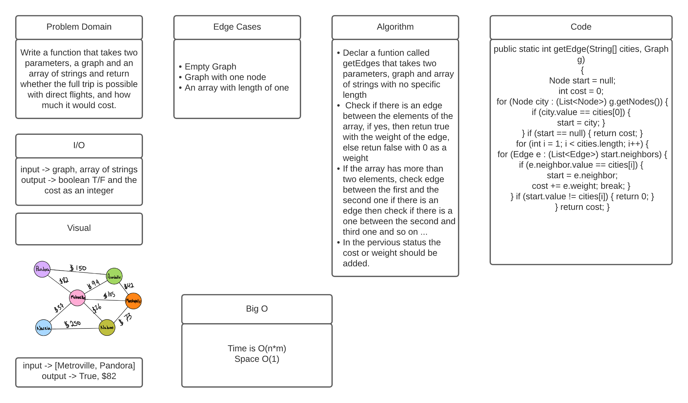

# Get Edge

## Challenge 
Write a function which takes in a graph, and an array of city names and return whether the full trip is possible with direct flights, and how much it would cost.

## Approach and Efficiency
The Time complexity for this method is O(n * m) where m represents the degree of the graph. Where the space complexity is O(1) since we just return the cost.

