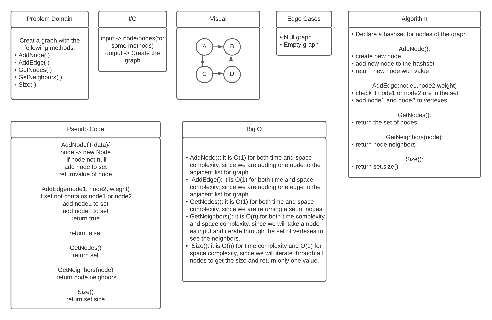

# Graph

## Challenge
Implement a graph with these method: 
* AddNode()
* AddEdge()
* GetNodes()
* GetNeighbors()
* Size()

## Approach & Efficiency
* AddNode(): it is O(1) for both time and space complexity, since we are adding one node to the adjacent list for graph.
* AddEdge(): it is O(1) for both time and space complexity, since we are adding one edge to the adjacent list for graph.
* GetNodes(): it is O(1) for both time and space complexity, since we are returning a set of nodes.
* GetNeighbors(): it is O(n) for both time complexity and space complexity, since we will take a node as input and iterate through the set of vertexes to see the neighbors.
* Size(): it is O(n) for time complexity and O(1) for space complexity, since we will iterate through all nodes to get the size and return only one value.

## API
* AddNode()
  * Adds a new node to the graph
  * Takes in the value of that node
  * Returns the added node

* AddEdge()
  * Adds a new edge between two nodes in the graph
  * Include the ability to have a “weight”
  * Takes in the two nodes to be connected by the edge
  * Both nodes should already be in the Graph

* GetNodes()
  * Returns all of the nodes in the graph as a collection (set, list, or similar)

* GetNeighbors()
  * Returns a collection of edges connected to the given node
  * Takes in a given node
  * Include the weight of the connection in the returned collection

* Size()
  * Returns the total number of nodes in the graph

