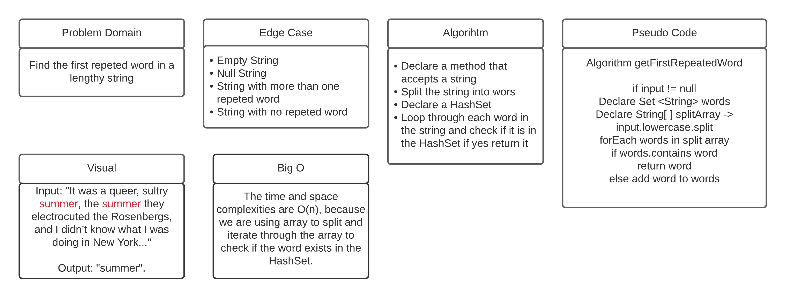

# Repeated Word

## Challenge 
Find the first repeated word in a lengthy string.

## Approach & Efficiency
The time and space complexities are O(n), because we are using array to split and iterate through the array to check if the word exists in the HashSet.

## API
***getFirstFrequentWord(String input)***: it takes an input of type String and check if the input is null or not, and then check and split the words in the input if it is not null.

## Whiteboard

