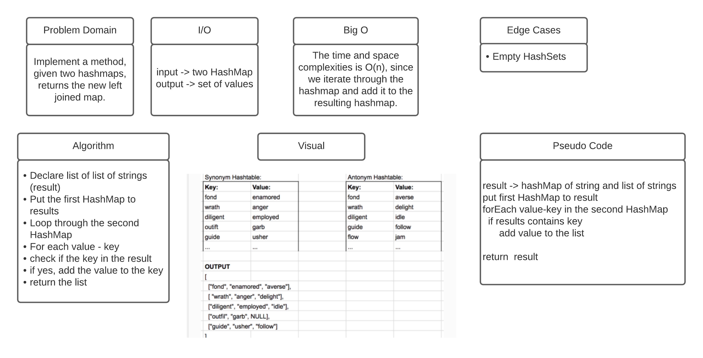

# Left Join

## Challenge
Implement a method, given two hashmaps, returns the new left joined map.

## Approach & Efficiency
 The time and space complexities is O(n), since we iterate through the hashmap and add it to the resulting hashmap.

## API
* leftJoin(HashMap<String, String> firstMap, HashMap<String, String> secondMap): function used to join left nodes from two sets into one set
* putMap(HashMap<String, String> input ): function used to add data to set.

