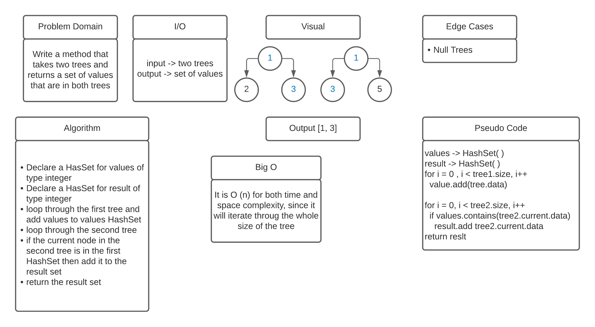

# Tree Intersection

## Challenge
Write a method that takes two trees and returns a set of values that are in both trees

## Approach & Efficiency
It is O (n) for both time and space complexity, since it will iterate through the whole size of the tree

## API
* createSet(Node root): function used to add data to the set
* treeIntersection(Tree input1, Tree input2): function used to check if two trees has same values.

